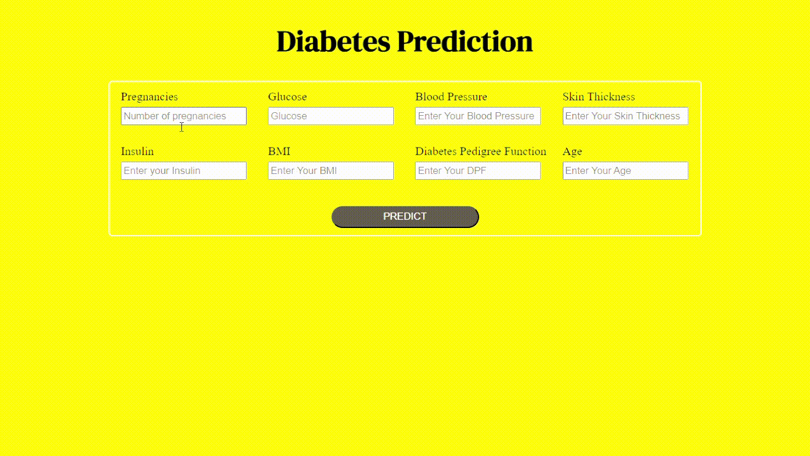

## Diabetes Prediction
This project explores the use of machine learning to predict diabetes risk based on a person's health condition. i am investigated various algorithms and chose the one with the best performance and interpretability. The project culminates in a user-friendly Flask app that allows users to input their health information and receive personalized predictions.

## Step by step on this project
1. Data Ingestion
   - Read the dataset after clean for missing value
   - split cleaned dataset into training and testing
     
2. Data Transformation
   - make pipeline for numerical column and apply standard scaler for this column
   - save this pipeline as preprocessor.pkl
     
3. Model Trainer
   - train several model for classification on training dataset
   - the best model is random forest
   - this best model save as model.pkl
     
4. Predict Pipeline
   - convert input data as dataframe
   - open preprocessor.pkl and model.pkl
   - use this new data for prediction using model.pkl and preprocessor.pkl
     
5. Make Flask App
   - make UI for predict wheter person have diabetes or don't have diabetes
